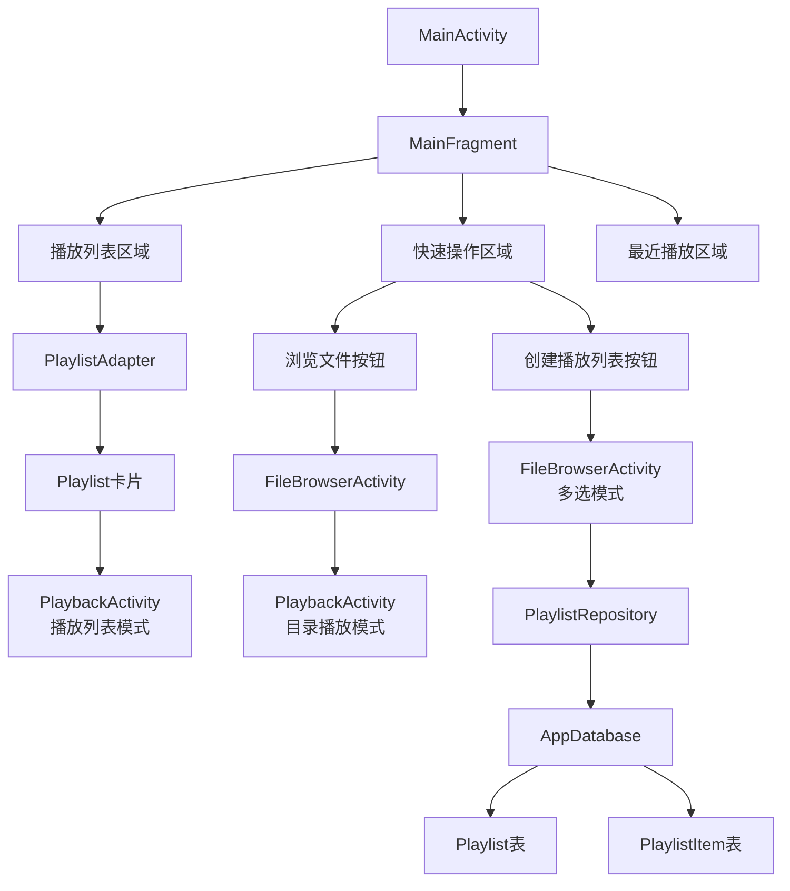
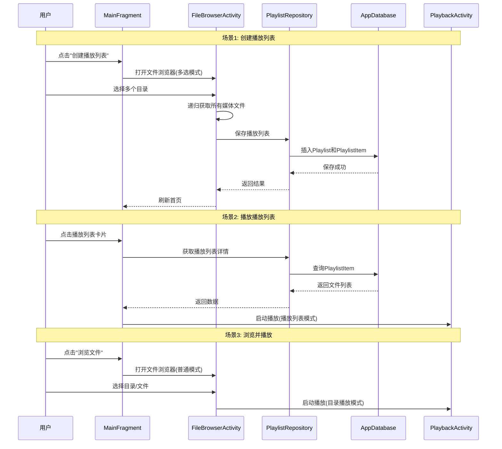
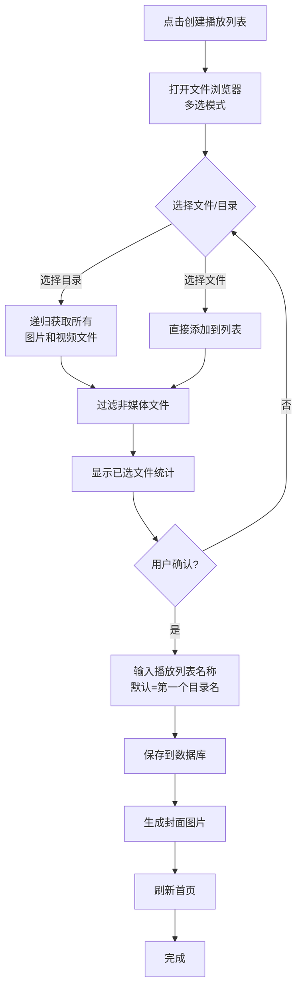
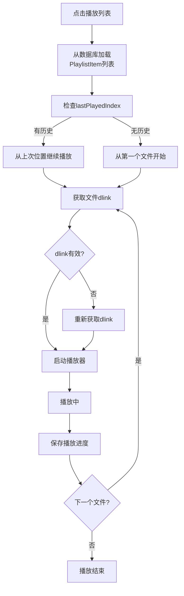
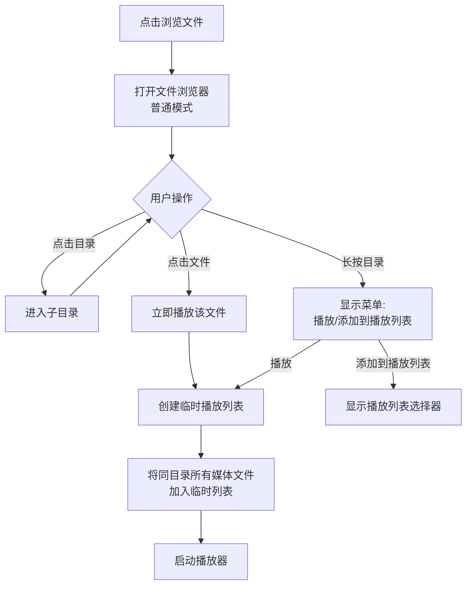

# 百度网盘播放器 - 新首页设计方案

## 一、需求分析

### 1.1 现有问题
1. **设置按钮占用首页空间** - 应该由遥控器菜单键打开
2. **三个圆形按钮无意义** - "图片"、"视频"、"全部"分类不实用
3. **缺少播放列表功能** - 无法保存和管理常用的播放内容
4. **播放列表创建困难** - 需要在电视上大量输入
5. **无法直接播放** - 即便没有播放列表，也应该能进入目录直接播放

### 1.2 设计目标
1. ✅ 移除首页设置按钮，使用遥控器菜单键触发
2. ✅ 用播放列表替换三个圆形按钮
3. ✅ 支持多选目录递归创建播放列表
4. ✅ 支持直接浏览文件并播放
5. ✅ 播放列表水平滚动展示
6. ✅ 点击播放列表直接播放

---

## 二、整体架构设计

### 2.1 架构图



### 2.2 数据流设计



---

## 三、数据库设计

### 3.1 数据库版本升级

**当前版本**: 1 (仅包含 `PlaybackHistory` 表)  
**目标版本**: 2 (添加 `Playlist` 和 `PlaylistItem` 表)

### 3.2 表结构设计

#### 3.2.1 Playlist 表 (播放列表)

```java
@Entity(tableName = "playlists")
public class Playlist {
    @PrimaryKey(autoGenerate = true)
    private long id;                    // 播放列表ID
    
    private String name;                // 播放列表名称
    private long createdAt;             // 创建时间（毫秒）
    private long lastPlayedAt;          // 最后播放时间（毫秒）
    private int lastPlayedIndex;        // 最后播放的文件索引
    private int mediaType;              // 媒体类型：0=混合, 1=视频, 2=图片
    private String coverImagePath;      // 封面图片路径
    private int totalItems;             // 总文件数
    private long totalDuration;         // 总时长（毫秒，仅视频）
    private int sortOrder;              // 排序顺序
    private String sourcePaths;         // 源目录路径列表 (JSON格式)
}
```

**字段说明**:
- `id`: 自增主键
- `name`: 播放列表名称，默认使用第一个目录名
- `sourcePaths`: **新增关键字段** - 记录创建列表时选择的所有源目录路径（例如 `["/我的照片/2023", "/我的视频/旅行"]`），用于后续刷新内容
- `createdAt`: 创建时间戳
- `lastPlayedAt`: 最后播放时间，用于"最近播放"排序
- `lastPlayedIndex`: 记住上次播放到第几个文件
- `mediaType`: 0=图片+视频混合, 1=仅视频, 2=仅图片
- `coverImagePath`: 播放列表封面，默认使用第一张图片/视频截图
- `totalItems`: 播放列表包含的文件总数
- `totalDuration`: 视频总时长，图片播放列表为0
- `sortOrder`: 用户自定义排序

#### 3.2.2 PlaylistItem 表 (播放列表项)

```java
@Entity(
    tableName = "playlist_items",
    foreignKeys = @ForeignKey(
        entity = Playlist.class,
        parentColumns = "id",
        childColumns = "playlistId",
        onDelete = ForeignKey.CASCADE  // 删除播放列表时级联删除所有项
    ),
    indices = {@Index("playlistId")}   // 为playlistId建立索引提高查询速度
)
public class PlaylistItem {
    @PrimaryKey(autoGenerate = true)
    private long id;                    // 播放列表项ID
    
    private long playlistId;            // 所属播放列表ID
    private long fsId;                  // 百度网盘文件fsId（用于获取dlink）
    private String filePath;            // 文件路径（相对路径）
    private String fileName;            // 文件名
    private int mediaType;              // 媒体类型：1=视频, 2=图片
    private int sortOrder;              // 排序顺序
    private long duration;              // 时长（毫秒，仅视频）
    private long fileSize;              // 文件大小（字节）
}
```

**字段说明**:
- `id`: 自增主键
- `playlistId`: 外键，关联到 `Playlist.id`
- `fsId`: **关键字段** - 百度网盘的文件唯一标识，播放时用于获取下载链接
- `filePath`: 文件在网盘中的完整路径
- `fileName`: 文件名，用于显示
- `mediaType`: 1=视频, 2=图片
- `sortOrder`: 播放列表内的排序顺序
- `duration`: 视频时长（图片为0）
- `fileSize`: 文件大小，用于显示和统计

**重要**: 不存储 `dlink`，因为下载链接有有效期，播放时需要实时获取。

### 3.3 数据库迁移策略

```java
@Database(
    entities = {
        PlaybackHistory.class, 
        Playlist.class, 
        PlaylistItem.class
    }, 
    version = 2,
    exportSchema = false
)
public abstract class AppDatabase extends RoomDatabase {
    
    public abstract PlaybackHistoryDao playbackHistoryDao();
    public abstract PlaylistDao playlistDao();
    public abstract PlaylistItemDao playlistItemDao();
    
    public static AppDatabase getInstance(Context context) {
        if (INSTANCE == null) {
            synchronized (AppDatabase.class) {
                if (INSTANCE == null) {
                    INSTANCE = Room.databaseBuilder(
                            context.getApplicationContext(),
                            AppDatabase.class, 
                            "baidu_tv_player.db"
                        )
                        .fallbackToDestructiveMigration()  // 开发阶段使用
                        // 生产环境应该提供迁移策略
                        .build();
                }
            }
        }
        return INSTANCE;
    }
}
```

---

## 四、UI 设计

### 4.1 新首页布局 (横屏 16:9)

```
┌────────────────────────────────────────────────────────────────┐
│  百度网盘播放器                         [遥控器菜单键 = 设置]  │
├────────────────────────────────────────────────────────────────┤
│                                                                │
│  我的播放列表                                       ← ─────→   │
│  ┌──────────┐  ┌──────────┐  ┌──────────┐  ┌──────────┐      │
│  │ [封面]   │  │ [封面]   │  │ [封面]   │  │ [封面]   │      │
│  │          │  │          │  │          │  │          │      │
│  │ 家庭照片 │  │ 旅行视频 │  │ 电影收藏 │  │ 音乐MV   │ ... │
│  │ 120张    │  │ 45个     │  │ 23个     │  │ 67个     │      │
│  └──────────┘  └──────────┘  └──────────┘  └──────────┘      │
│                                                                │
│  快速操作                                                      │
│  ┌──────────┐  ┌──────────┐                                  │
│  │  📂      │  │  ➕      │                                  │
│  │ 浏览文件 │  │创建播放  │                                  │
│  │          │  │  列表    │                                  │
│  └──────────┘  └──────────┘                                  │
│                                                                │
│  最近播放                                                      │
│  ┌──────────┐  ┌──────────┐  ┌──────────┐  ┌──────────┐      │
│  │ [缩略图] │  │ [缩略图] │  │ [缩略图] │  │ [缩略图] │      │
│  │ 文件名   │  │ 文件名   │  │ 文件名   │  │ 文件名   │      │
│  └──────────┘  └──────────┘  └──────────┘  └──────────┘      │
└────────────────────────────────────────────────────────────────┘
```

### 4.2 播放列表卡片设计

**尺寸**: 16:9 比例，宽度约 280dp

**内容**:
1. **封面图片** (顶部，高度160dp)
   - 显示播放列表第一张图片或视频截图
   - 如果没有封面，显示默认图标
   - 焦点时放大1.1倍并显示边框

2. **标题** (中间，高度48dp)
   - 播放列表名称
   - 最多显示2行，超出显示省略号
   - 字体大小: 18sp

3. **统计信息** (底部，高度32dp)
   - 文件数量: "120张照片" 或 "45个视频"
   - 总时长(仅视频): "2小时30分钟"
   - 字体大小: 14sp, 颜色: 灰色

4. **播放进度** (可选，底部叠加)
   - 显示上次播放到第几个文件
   - 进度条: 当前索引/总数

### 4.3 遥控器按键映射

| 按键 | 功能 |
|------|------|
| **方向键 ←→** | 在播放列表之间水平移动 |
| **方向键 ↑↓** | 在播放列表、快速操作、最近播放之间垂直移动 |
| **确认键** | 播放选中的播放列表/打开选中的功能 |
| **菜单键** | 打开设置界面 |
| **返回键** | 退出应用或返回上一级 |
| **长按确认键** | 显示播放列表操作菜单(播放/刷新/删除/重命名) |

### 4.4 XML 布局结构

```xml
<RelativeLayout>
    <!-- 标题栏 -->
    <TextView id="tv_title" text="百度网盘播放器" />
    
    <!-- 播放列表区域 -->
    <LinearLayout id="ll_playlist_section">
        <TextView id="tv_playlist_title" text="我的播放列表" />
        
        <!-- 水平滚动的播放列表 -->
        <RecyclerView 
            id="rv_playlists"
            orientation="horizontal"
            layoutManager="LinearLayoutManager" />
    </LinearLayout>
    
    <!-- 快速操作区域 -->
    <LinearLayout id="ll_quick_actions">
        <TextView id="tv_quick_title" text="快速操作" />
        
        <LinearLayout orientation="horizontal">
            <LinearLayout id="btn_browse_files">
                <ImageView drawable="@android:drawable/ic_menu_view" />
                <TextView text="浏览文件" />
            </LinearLayout>
            
            <LinearLayout id="btn_create_playlist">
                <ImageView drawable="@android:drawable/ic_menu_add" />
                <TextView text="创建播放列表" />
            </LinearLayout>
        </LinearLayout>
    </LinearLayout>
    
    <!-- 最近播放区域 (保留现有功能) -->
    <LinearLayout id="ll_recent_section">
        <TextView id="tv_recent_title" text="最近播放" />
        <RecyclerView id="rv_recent_tasks" />
    </LinearLayout>
</RelativeLayout>
```

---

## 五、核心功能设计

### 5.1 创建播放列表流程



**关键实现点**:
1. **多选模式**: 在 `FileBrowserFragment` 中添加多选模式开关
2. **递归获取**: 复用 `FileRepository.getFileListRecursive()` 方法
3. **文件过滤**: 只保留 `isImage()` 或 `isVideo()` 的文件
4. **存储 fsId**: 存储 `FileInfo.fsId` 而非 `dlink`
5. **默认名称**: 使用第一个选中目录的名称作为播放列表名称

### 5.2 播放播放列表流程



**关键实现点**:
1. **断点续播**: 记录 `lastPlayedIndex` 和 `lastPlayedAt`
2. **dlink 刷新**: 播放时实时调用API获取下载链接
3. **播放模式**: 支持顺序播放、随机播放、单曲循环
4. **进度保存**: 播放结束或退出时更新数据库

### 5.3 播放列表刷新流程 (新增)

```mermaid
graph TD
    A[长按播放列表] --> B[选择"刷新内容"]
    B --> C[读取sourcePaths字段]
    C --> D[清空当前列表所有项]
    D --> E[重新递归扫描<br/>所有源目录]
    E --> F[插入新的文件项]
    F --> G[更新统计信息<br/>(数量/时长/封面)]
    G --> H[提示刷新成功]
```

### 5.4 直接浏览并播放流程



**关键实现点**:
1. **临时播放列表**: 不保存到数据库，仅在内存中
2. **目录播放**: 自动将同目录所有媒体文件加入播放队列
3. **快速访问**: 无需创建播放列表即可播放

---

## 六、可复用的现有组件

### 6.1 数据层

| 组件 | 路径 | 复用方式 |
|------|------|----------|
| **FileRepository** | `repository/FileRepository.java` | ✅ 直接复用 `getFileList()` 和递归获取方法 |
| **PlaybackHistoryRepository** | `repository/PlaybackHistoryRepository.java` | ✅ 保留，用于"最近播放"功能 |
| **AppDatabase** | `database/AppDatabase.java` | 🔧 需要扩展（添加新表） |
| **AuthRepository** | `auth/AuthRepository.java` | ✅ 直接复用（获取access_token） |

### 6.2 UI层

| 组件 | 路径 | 复用方式 |
|------|------|----------|
| **FileBrowserActivity** | `ui/filebrowser/FileBrowserActivity.java` | 🔧 需要扩展（添加多选模式） |
| **FileAdapter** | `ui/filebrowser/FileAdapter.java` | 🔧 需要扩展（添加多选UI） |
| **PlaybackActivity** | `ui/playback/PlaybackActivity.java` | 🔧 需要扩展（支持播放列表模式） |
| **RecentTaskAdapter** | `ui/main/RecentTaskAdapter.java` | ✅ 保留，用于"最近播放" |

### 6.3 Model层

| 组件 | 路径 | 复用方式 |
|------|------|----------|
| **FileInfo** | `model/FileInfo.java` | ✅ 直接复用（包含 `fsId`、`isImage()`、`isVideo()` 等方法） |
| **PlaybackHistory** | `model/PlaybackHistory.java` | ✅ 保留，用于播放历史 |
| **MediaType** | `model/MediaType.java` | ✅ 直接复用 |

### 6.4 工具类

| 组件 | 路径 | 复用方式 |
|------|------|----------|
| **PlaylistCache** | `utils/PlaylistCache.java` | ✅ 直接复用（临时播放列表缓存） |
| **PreferenceUtils** | `utils/PreferenceUtils.java` | ✅ 直接复用（保存设置） |
| **LocationUtils** | `utils/LocationUtils.java` | ✅ 直接复用（照片位置信息） |

---

## 七、需要新增的组件

### 7.1 数据层新增

1. **Playlist.java** - 播放列表实体类
2. **PlaylistItem.java** - 播放列表项实体类
3. **PlaylistDao.java** - 播放列表数据访问对象
4. **PlaylistItemDao.java** - 播放列表项数据访问对象
5. **PlaylistRepository.java** - 播放列表数据仓库

### 7.2 UI层新增

1. **PlaylistAdapter.java** - 播放列表RecyclerView适配器
2. **PlaylistCardViewHolder.java** - 播放列表卡片ViewHolder
3. **item_playlist_card.xml** - 播放列表卡片布局
4. **PlaylistMenuDialog.java** - 播放列表操作菜单（播放/编辑/删除/重命名）

### 7.3 ViewModel新增

1. **PlaylistViewModel.java** - 播放列表视图模型

---

## 八、需要修改的组件

### 8.1 MainFragment.java

**修改内容**:
1. ❌ 移除三个圆形按钮的点击事件
2. ❌ 移除设置按钮
3. ✅ 添加播放列表 `RecyclerView`
4. ✅ 添加"浏览文件"和"创建播放列表"按钮
5. ✅ 添加遥控器菜单键监听（打开设置）
6. ✅ 保留"最近播放"区域

### 8.2 fragment_main.xml

**修改内容**:
1. ❌ 移除设置按钮 `btn_settings`
2. ❌ 移除三个圆形按钮区域 `ll_media_types`
3. ✅ 添加播放列表区域 `ll_playlist_section`
4. ✅ 添加快速操作区域 `ll_quick_actions`
5. ✅ 保留最近播放区域 `ll_recent_section`

### 8.3 FileBrowserFragment.java

**修改内容**:
1. ✅ 添加多选模式支持 `isMultiSelectMode`
2. ✅ 添加选中文件列表 `selectedFiles`
3. ✅ 添加"确认选择"按钮（仅多选模式显示）
4. ✅ 添加递归获取目录文件的方法
5. ✅ 修改返回值，支持返回选中的文件列表

### 8.4 FileAdapter.java

**修改内容**:
1. ✅ 添加多选模式UI（显示复选框）
2. ✅ 添加选中状态管理
3. ✅ 修改点击事件（多选模式下切换选中状态）

### 8.5 PlaybackActivity.java

**修改内容**:
1. ✅ 添加播放列表模式支持
2. ✅ 添加从数据库加载播放列表的方法
3. ✅ 添加播放进度保存到数据库
4. ✅ 修改播放队列管理（支持播放列表）

### 8.6 MainActivity.java

**修改内容**:
1. ✅ 添加遥控器按键监听
2. ✅ 菜单键打开设置界面

---

## 九、实现优先级

### 阶段1: 数据库基础 (高优先级)
1. ✅ 创建 `Playlist.java` 实体类
2. ✅ 创建 `PlaylistItem.java` 实体类
3. ✅ 创建 `PlaylistDao.java`
4. ✅ 创建 `PlaylistItemDao.java`
5. ✅ 修改 `AppDatabase.java` 升级到版本2
6. ✅ 创建 `PlaylistRepository.java`

### 阶段2: 首页UI改造 (高优先级)
1. ✅ 修改 `fragment_main.xml` 布局
2. ✅ 创建 `item_playlist_card.xml` 播放列表卡片
3. ✅ 创建 `PlaylistAdapter.java`
4. ✅ 修改 `MainFragment.java`
5. ✅ 添加遥控器菜单键监听

### 阶段3: 文件浏览器多选 (中优先级)
1. ✅ 修改 `FileBrowserFragment.java` 添加多选模式
2. ✅ 修改 `FileAdapter.java` 添加多选UI
3. ✅ 添加"确认选择"按钮
4. ✅ 实现递归获取目录文件

### 阶段4: 播放列表创建 (中优先级)
1. ✅ 实现选择文件后保存到数据库
2. ✅ 实现播放列表名称输入对话框
3. ✅ 实现封面图片生成
4. ✅ 实现刷新首页播放列表

### 阶段5: 播放功能集成 (中优先级)
1. ✅ 修改 `PlaybackActivity.java` 支持播放列表模式
2. ✅ 实现从数据库加载播放列表
3. ✅ 实现播放进度保存
4. ✅ 实现断点续播

### 阶段6: 高级功能 (低优先级)
1. 🔲 播放列表编辑（添加/删除文件）
2. 🔲 播放列表重命名
3. 🔲 播放列表删除
4. 🔲 播放列表排序
5. 🔲 封面自定义
6. 🔲 播放模式（顺序/随机/循环）

---

## 十、注意事项和风险

### 10.1 技术风险

1. **数据库迁移**
   - ⚠️ 从版本1升级到版本2需要谨慎
   - ✅ 使用 `.fallbackToDestructiveMigration()` 开发阶段允许重建数据库
   - 📌 生产环境需要提供迁移策略保留用户数据

2. **文件数量限制**
   - ⚠️ 百度网盘目录可能包含上万个文件
   - ✅ 复用 `FileRepository` 的分页加载机制（最多5000个文件）
   - 📌 创建播放列表时显示进度提示

3. **dlink有效期**
   - ⚠️ 下载链接24小时后失效
   - ✅ 播放时实时获取dlink，不存储到数据库
   - 📌 处理dlink失效的异常情况

### 10.2 用户体验风险

1. **遥控器操作**
   - ⚠️ 电视遥控器按键有限
   - ✅ 菜单键打开设置（Android TV标准做法）
   - 📌 测试不同品牌电视遥控器兼容性

2. **播放列表名称输入**
   - ⚠️ 电视输入文本困难
   - ✅ 提供默认名称（第一个目录名）
   - 📌 支持使用遥控器数字键快速输入

3. **焦点管理**
   - ⚠️ 水平滚动的焦点处理复杂
   - ✅ 使用 `RecyclerView` 的焦点管理
   - 📌 测试焦点在播放列表、快速操作、最近播放之间的移动

### 10.3 性能风险

1. **播放列表加载**
   - ⚠️ 大量播放列表可能导致UI卡顿
   - ✅ 使用分页加载（每页10个）
   -